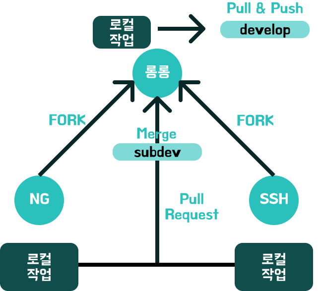

# Git 버전관리

## 우아할 형제들이 선택한 브랜치 전략
---
### 3가지 브랜치
- subdev
- develop
- release
> subdev 브랜치
>> merge과정 중 일어날 수 있는 모든 conflict를 기록하고, conflict를 관찰하는 브랜치
>>> git을 완전히 이해 못한 우아할 형제들은 브랜치를 언제 삭제해야할 지 모르는 상황에 대비해 subdev라는 브랜치를 생성했다.

> develop 브랜치
>> subdev 브랜치에서 무사히 merge를 마치고 완료된 프로젝트를 develop 브랜치로 옮기기 위해 생성한 브랜치이다.
>>> 항상 confilct 등의 오류가 해결된 상태의 프로젝트가 저장된다.

> release 브랜치
>> CI/CD 플랫폼에 자동 빌드될 브랜치를 생성했다.

### (subdev, dev)브랜치에 저장되는 과정

우아할형제들 프로젝트의 주 레포지토리는 [롱롱](https://github.com/rjsej12/woowahal)님의 Github 레포지토리다.

NG님과 SSH님은 각자의 Github에서 롱롱님의 레포지토리를 fork한다.

롱롱님은 자신의 로컬의 브랜치를 작업 완료 후 subdev에 merge한다.

NG님과 SSH님은 각각의 로컬 환경에서 작업 후 주 저장소에 Pull Request를 요청한다.

맡은 작업을 pull request merge 과정을 함께 관찰하면서, conflict를 해결한다.
문제없이 해결된 작업들은 subdev에 merge가 완료되고, develop로 pull하여 저장한다.

